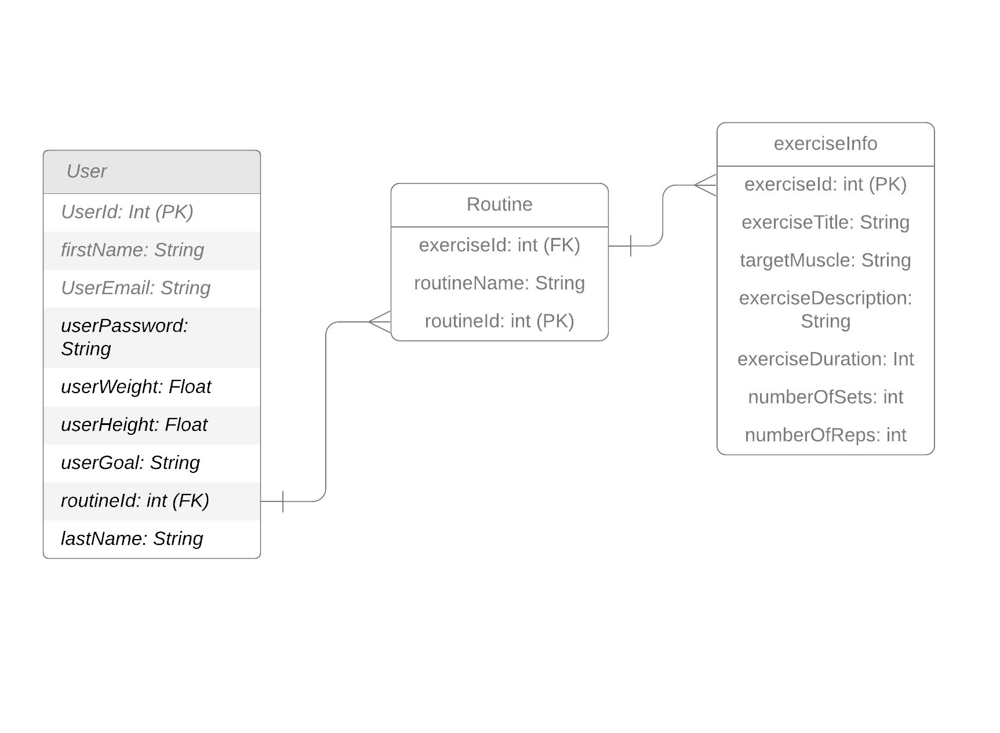
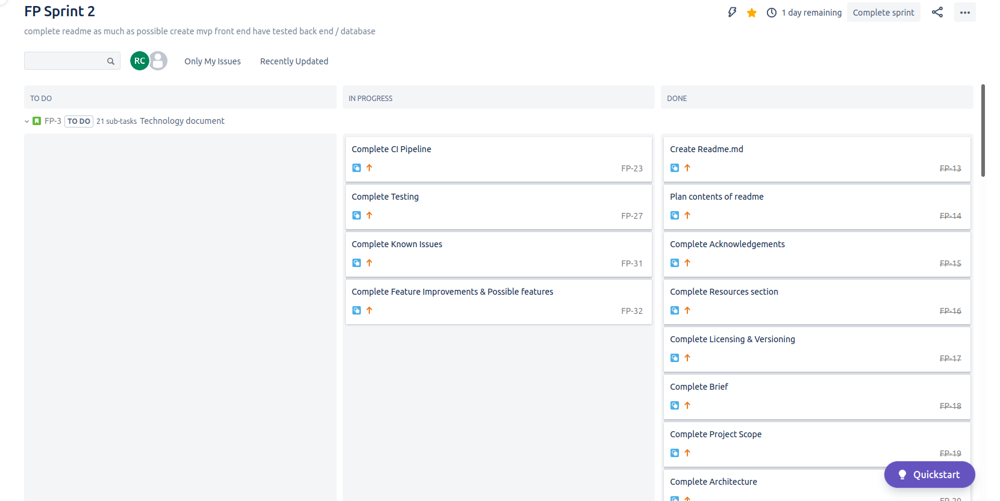

# Fundamental_Project

## QA Academy

### Cloud Native Engineer (DevOps) Learning Path

<h3 align="center">
Pump It App
</h3>

    

> Take care of **your body**. It's the _only place you have to live_.

 ~ Jim Rohn

## Installation Process

To be continued at a later date.

## Contents

* [Acknowledgements](#Acknowledgements)
* [Resources](#Resources)
* [Licensing & versioning](#licensing-&-Versioning)
* [Brief](#Brief)
    * [Project Scope (Additional Requirements)](#Project-Scope-(Additional-Requirements))
* [Technologies](#Technologies)
* [My Approach](#My-Approach)
    * [Project Introduction](#Project-Introduction)
* [Architecture](#Architecture)
    * [Database Structure](#Database-Structure)
    * [CI Pipeline](#CI-Pipeline)
* [Project Tracking](#Project-Tracking)
* [MoSCoW Analysis](#MOSCOW-Analysis)
* [Risk Assessment](#Risk-Assessment)
* [Data Protection (GDPR)](#Data-Protection-(GDPR))
* [Security](#Security)
* [Testing](#Testing)
    * [Unit Testing](#Unit-Testing)
    * [Integration Testing](#Integration-Testing)
* [Frontend Design](#Frontend-Design)
* [Application Feature Outline](#Application-Feature-Outline)
    * [User Story](#User-Stories)
        * [What makes a User Story?](#so-what-makes-a-user-story)
    * [Page planning](#Page-planning)
* [Known Issues](#Known-Issues)
* [Future Improvements & possible Features](#Future-Improvements-&-possible-features)
* [Author](#Author)

## Acknowledgements

Acknowledgements go to:
 
 * QA Academy
 * Tadas Vaidotas (Principle Learning Specialist)
 * Jay Grindrod (Learning Specialist)
  
  All of whom without I would not have amassed the knowledge, nor the skill-set to have made this project come to life.

## Resources

Donald Pump image from bodybuilding_humour

## Licensing & Versioning

Version 1.0.1a

## Brief

The brief provided for the project sets the following out as the overall objective:

> To create a CRUD application with the utilisation of supporting tools, methodologies and technologies that encapsulate all core modules covered during training

CRUD Stands for :

* Create
* Read
* Update
* Delete

This means that the application that is to be created will perform create, read, update and delete (CRUD) functions. The project will demonstrate my mastery of the knowledge and skill-set so far, in particular the following skill-set learned from all core training modules:

* Project Management
* Databases
* Java SE
* Spring Boot
* Front-End Development
* Automated Testing
* Continuous Integration
* Cloud Fundamentals

[Back to Contents](#Contents)
## Project Scope (Additional Requirements)

The minimum requirements for the project were as follows:

* Jira board containing a full expansion for user stories, use cases and history of tasks needed to complete the project

* Clear documentation outlining clearly from the design phase. THis was to include the architecture to be used.

* A detailed risk assessment that outlines and addresses all risks from start to finish of the project

* A relational database must be used for persistent data storage (GCP Managed SQL Server)

* The project must result in a functional application created in an OOP language (JAVA)

* Application must meet requirements set in Kanban Board

* The application must have functioning front-end website, and an integrated API

* Fully designed test suites must be created for the application, and these also include automated tests for validation of the application

* Test coverage of the application of the back-end must provide consistent evidence indicating acceptable level of coverage

* All code is fully integrated into a Version Control System

* Code is built through a CI server

* Application is deployed to a cloud-based virtual Machine

[Back to Contents](#Contents)

## Technologies

The following project constraints are as follows in the table:

| Technology | Use     |
| ---------- |---------|
| Jira       | Kanban board, Task Management / Tracking|
| GCP Managed SQL Server| Database|
| Java | Programming Language, Back-end |
| HTML | Markup Language, Front-End|
| CSS | Styling Sheet Language, Front-end|
| JavaScript | Scripting Language, Front-end|
| JUnit & Mockito | Unit Testing |
| Selenium | Integration Testing |
| Git | Version Control |
| CircleCI | CI Server |
| GCP Virtual Machine | Cloud Server |

[Back to Contents](#Contents)

## My Approach

In order to achieve this I decided on producing an application on a subject rather topical in the current economic climate and rather close to my heart in the following introduction:

[Back to Contents](#Contents)

### Project Introduction

In the current climate with everyone being stuck inside, exercise has never been more been at the forefront of peoples minds. This Web App will attempt to address the need for creative ideas, educational information and provide the user the ability create their own activities, update these activities and delete them if necessary.

In the initial stages this application will display CRUD principles only for the purpose of the scope of the marking for this project. I will be adding more functionality to it in an iterative manner as I develop my knowledge and techniques.

[Back to Contents](#Contents)

## Architecture

[Back to Contents](#Contents)

### Database Structure

    

Creating a UML was very important in being able to visualise the relational database to be created. This UML shows the one to many relationship between users, routines and exercises takes shape. In a short summary, one user can have many routines and one routine can have many exercises. This concept is crucial to creating the database and the overall way I would want to implement CRUD functionality.

[Back to Contents](#Contents)

### CI Pipeline

[Pipeline goes here]

[Back to Contents](#Contents)

## Project Tracking

    

Jira is a useful tool that was selected as it supports roadmapping requirements. It empowers the user to sketch out the big picture, communicate plans and enables to connect the overarching bigger roadmap goals between each individual and team to deadlines and daily tasks. It is great for Agile Methodologies and can be integrated with other applications such as teams for easier monitoring of progress which shows just how customisable it can be. This flexibility is probably its largest positive feature as different approaches can be accommodated and companies can still work in a positive and efficient manner.

[Back to Contents](#Contents)

## MOSCOW Analysis

The MoSCow Analysis is a technique that is very commonly used in management, particularly in project management and software development.  In short, this principle effectively provides perspective and focus on managing expectations within a project. It is a useful tool when communicating with stakeholders about what elements of the project should have priority and what parts should be re-evaluated. It is usually used in conjunction with timeboxing  and is commonly used in agile software development approaches like Scrum.

MoSCoW itself is an acronym where the capital letters are all derived from the four categories of prioritization:

* Must have - priorities that are critical to the success of the deadline
* Should have - priorities that are important for the product but not necessary for the current deadline
* Could have - priorities that are desirable but not necessary. Usually this would tend to be UI/UX improvements and are typically included if time and resources permit.
* Won't have - time to carry out these priorities for the current deadline and have been agreed upon and will usually be re-evaluated.

|Must Have | Should Have | Could Have | Won't Have |
|----------|-------------|------------|------------|
| CRUD functionality | Log-in  functionality | aesthetic Front-End Design | Using quote generator to create fun inspirational quotes each time user logs in      | 
|          |             | Inspirational Quote Generator | |
[Back to Contents](#Contents)

## Risk Assessment

Before any work on the project is under way, it is important to assess the various risks that can affect successful completion. In the analysisI have included various risks that could affect each stage of the project ranging from SQL injections through to the likelihood of the risk and the impact.
Using this information I am able to classify each risk into an appropriate column.

| Threat                    | Issue  Type | Description                                         | Likelihood | Impact | Responsibility | Current Mitigation      | Proposed Mitigation                               | Response                                      | Tolerance |
|---------------------------|-------------|-----------------------------------------------------|------------|--------|----------------|-------------------------|---------------------------------------------------|-----------------------------------------------|-----------|
| SQL Database Inaccessible | Technical   | MySQL database hosted by the Google Cloud Platform (GCP) could become inaccessible rendering the application unusable |    Low     |  Low   |     GCP        | N/A    |    Set back up for database by either a dedicated VM which allows for cloning of the DB into another| Try restarting database manually. Failure would then lead to contact GCP | Tolerate             |                                                 
| VM hosting Inaccessible   | Technical   | The application database relies on the Virtual Machine (VM) which is hosted by the GCP    |   Low         |  Low      |  GCP              |     N/A                    | Set back up; dedicated VM; cloning of database  |  manual restart; failure leads to contacting GCP   |  Tolerate | 
| Invalid data input        | User        | Human error could lead to errors made during input of data |  Medium    | High   | Rohan Chauhan  | N/A                     | N/A                                               | N/A                                           |  Treat    |
| HTTP vs HTTPS             |  Technical  | connections made use Hypertext Transfer Protocol (HTTP) are not encrypted. Using a more secure form of HTTP called HTTPS would prevent transferred data to be visible to any potential exploiters   |  High      | Low    | Rohan Chauhan  | N/A                     | Employ HTTPS connections                          | If any inconsistencies have been discovered in the app data, backups must be used to restore consistency  |   Treat   |
| COVID - 19 / illness      |Non-technical| The virus is still prevalent, despite lockdown measures. It would be very possible to contract the virus or some other disease that would render me unable to complete the project    |   Low      | High   | Rohan Chauhan  | Following government advice such as the use of face covering and social distancing when in contact with people   | Following government directives                   | N/A                                           | Tolerate  |

##### Definition 
Key

|            | Low                    | Medium                                                                            | High                                                                                                    |
|------------|------------------------|-----------------------------------------------------------------------------------|---------------------------------------------------------------------------------------------------------|
| Likelihood | unlikely risk to occur | risk likely to occur but current measurements are enough to mitigate consequences | very likely to occur and the current resources and measurements are not enough. Further action required |
| Impact     | measurements in place are effective and lost resources can be covered | the risk that occurs does not lead to major malfunctions of the application or loss of data   | the consequence of inaction will lead to site malfunction and or inaccessibility and thus loss of user base |

Risk Tolerance would dictate whether action would need to be taken or if the current measurements in place were enough to manage the perceived or current risk (Tolerate) or not and further action needed to be taken (Treat).
                 
[Back to Contents](#Contents)

## Data Protection (GDPR)

Despite the United kingdom breaking from the European Union, GDPR laws still come into play as potential customers may be from EU countries and the law stipulates that any applications that allow this kind of access must
be GDPR compliant. The major directive power of the law is that it empowers the individual to control their data. Entities that ask for personal data online must disclose to the individual what will happen to the data, who has access to the data and 
who can view their data from the moment it is submitted. This brings to light the importance of security for web apps.

The four most important aspects of the law dictate:

* > Easier access to your own data: individuals will have more information on how their data is processed and this information should be available in a clear and understandable way.
* > A right to data portability: it will be easier to transfer your personal data between service providers.
* > A clarified 'right to be forgotten': when you no longer want your data to be processed, and provided that there are no legitimate grounds for retaining it, the data will be delete.
* >The right to know when your data has been hacked: For example, companies and organizations must notify the national supervisory authority of serious data breaches as soon as possible so that users can take appropriate measures.

## Security

Following best practice guidance, the application will hold and implement as little personal data as is possible such as the birth name, email and country of residence. It should be noted that as the application grows, the need for more personal information is also likely to grow.
The data procured must be encrypted and hashed to avoid any form of data extraction during a data breach and that individuals are kept up to date with any such exposures. OAUTH is one potential way of minimising personal data use whilst increasing the use of authentication ID however, due to time contraints 
it is unlikely to have been implemented for the current project deadline. There will be a table to highlight what will be implemented into the application and what will be put on hold for future sprints should the opportunity arise.

Since the application will require authentication, HTTPS would be needed, and it would be prudent to ensure that SSL certificates are up to date and properly deployed to avoid vulnerabilities to SSL protocols.
The application will also take in some personal information (through registration or contact form) such as emails and names and we must ensure that the customers are informed and clear on how this data is used and for how long it is stored. This will be implemented through the use of a terms and conditions as part of the registration process to create an account.
The information stored will be encrypted and stored on the GCP. Google Cloud will be in charge of ensuring that the data is stored safely and it is in their remit on legals grounds posited by the GDPR. As a developer I do not need to concern myself about this part of my obligation.
Users must have proper notice about the use of cookies used by the application. Users should be told that cookies are in use and what the cookies would be used for. Users should also have the choice to accept or deny cookies. Cookies must be properly destroyed after a user session has been concluded through logout or session inactivity. At this point, the application will not be storing data for commercial purposes.
The application is purely for the user to store their activities and their personal use. In the future this may change as it would make financial sense for advertising.

When registering for an account, users will be asked to create security questions which must not include personal components, as per GDPR. If it is possible, in the future two-factor authentication will be where I would want to strive for the application to be in but this will not be in the current implementation fo the application.
Another part of the registration will incorporate the terms and conditions which is an opportunity for clients to really become clear on what it is that they have signed up for and how their data will be used. An enforcement mechanism is necessary to have clear evidence that users have agreed to terms and conditions and only then can they use the application.
Any user who decides to delete their account must have a clear way of doing so and once they have left the service their account information must be deleted. 

Failure in any of the mandated points of the GDPR will lead to high penalties.

## Testing

Once the frontend and the backend were completed and linked together, deep testing would be required to ensure the functionality of both aspects of the application.
Testing was carried out using Junit and Selenium in two replicable ways as shown below.

## Unit Testing

This format of testing is used to test small components (or units) within the application in controlled environments.

## Integration Testing

This format of testing is the next level up from unit testing and is where individual units are combined and tested as a group. 
The purpose is to expose defect or faults in interaction between units. Integration testing can be component integration testing where testing is performed to expose 
integration between the interfaces of integrated components. System integration testing is used to test the systems and the packages or testing interfaces between 
the interfaces and external organizations.

[Back to Contents](#Contents)

## Frontend Design

[Back to Contents](#Contents)

## Application Feature Outline

* User can create and delete their account
* User can create, read and update their account
* User can create activities
* User can read activities
* User can update activities
* User can delete activities
* Using quote generator to create fun inspirational quotes each time user logs in 

## User Stories

There are multiple items in Product backlogging. Typically, using user stories is a common type of Product Backlog Item.
The user story is essentially what the end goal will look like from the perspective of a particular user's point of view.
This user could be the customers (external user), or the client or even the developer (internal user) using the product and focuses on what
the individual wants to do rather than how they would do it. An external user would be someone who simply uses the product as it is intended, 
and will not have any access to the inner workings of the app. Internal users would people like developers who may be creating a new feature for 
the product. The main point of a user story is to _express the end goal as simply as is possible so that everyone can understand_.

 ### So what makes a User Story?

Using JIRA, I created multiple user stories the followed the process discussed at a high overview level. I will quickly describe some examples from my point as a developer.
Using JIRA to create an Epic I was able to create multiple user stories. A single user story is made up of multiple tasks that are to be completed. This one to many relationships (1 epic - many stories and 1 story - many tasks) really made
breaking down the whole overarching goal of creating a CRUD web application much easier by allowing me to break the smaller goals even further into more manageable sizes. It also enabled me to really give myself realistic
time management, so I could always know where I was in a sprint and if I was on schedule or not. 

For example, breaking down "creating the front end" which would be my epic, I could produce a user story of what a customer for the application would need in order to create and track their work outs (Story). 
This would mean that as a customer in order to be able to create a new work out diary I need to be able to log in to my account first (task 1) and then be able to create my diary for the day (task 2). 

As a developer these two tasks could be broken down further into creating the log-in page, ensuring that back-end logic checked for user's credentials to match against database records and if successful, allow them to log in (task 1). 
Once the user is logged in they would need to be redirected to a bespoke welcome page where they would then be able to create their work-out diary (task 2). I go into more technical detail in the next section.

    

### Page planning 

The project will utilise HTML, CSS and Javascript with bootstrap to create a visually appealing front-end. Later if time permits there will be plans to incorporate React for this front-end.

Currently, there are plans for a homepage where current and prospective users can log in or make a new account. If at any point a new user tries to navigate to a page where they do not have access to they will be redirected to the login or make a new account page.

Customers that are logged in will see a welcome back page instead of the home page. On this home page will be the latest inspirational quote, and the last activity the customer had added.

If a customer wants to add a new activity they can click on the add button (has a "+" symbol) where they will be redirected to the add-an-activity page and can start to make the necessary additions to their activity.

If a customer wants to make a change and update an existing activity from the welcome page they are able to hover over the activity to show a drop down of options. Alternatively, the customer can go to the activities page.
The final part of the application at this stage would allow for the user to delete their created account should they decide they do not want to use the application. To do this, they can navigate to their profile page where they can then delete their account.

| Page | User Logged in (Y/N) | Available Actions |
| ---- | -------------------- | ----------------- |
| Home | N                    | Option to log in or create a new account |
|      | Y                    | Customer redirected to Welcome Back page |
|Activity Page | N            | User redirected to Home Page             |
|      | Y                    | User directed to activity page and can create, read, update or delete activities|     

[Back to Contents](#Contents)

## Known Issues

[Back to Contents](#Contents)

## Future Improvements & possible features

* Plan to add the ability to allow user to upload a profile picture
* allow for 0AUTH social media sign in 

[Back to Contents](#Contents)

## Author

Rohan Chauhan